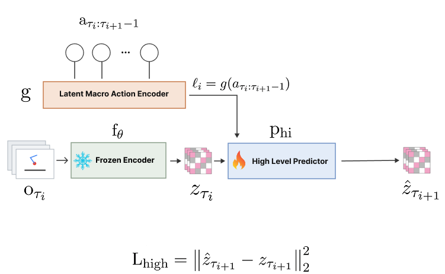
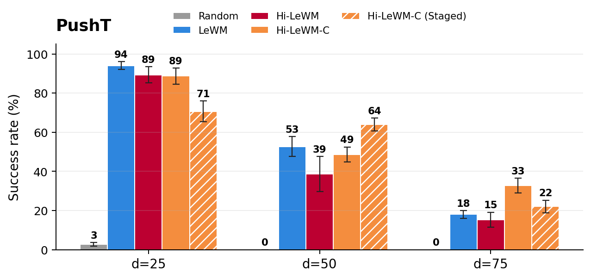
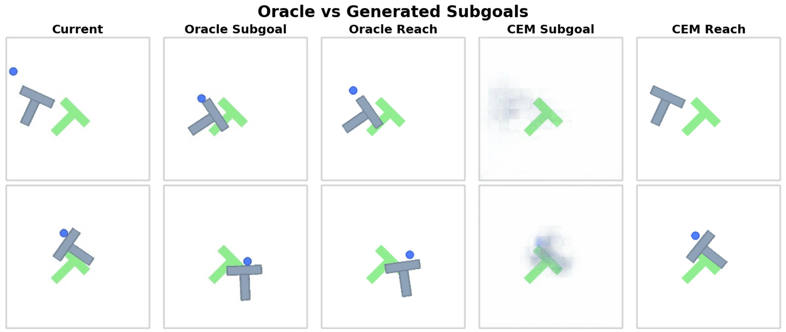
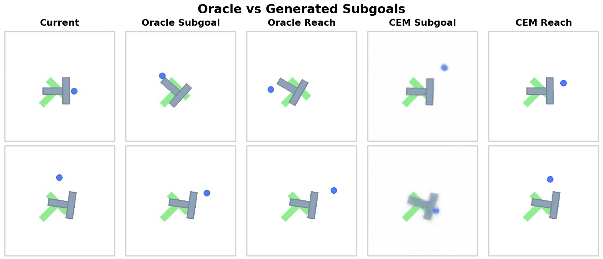
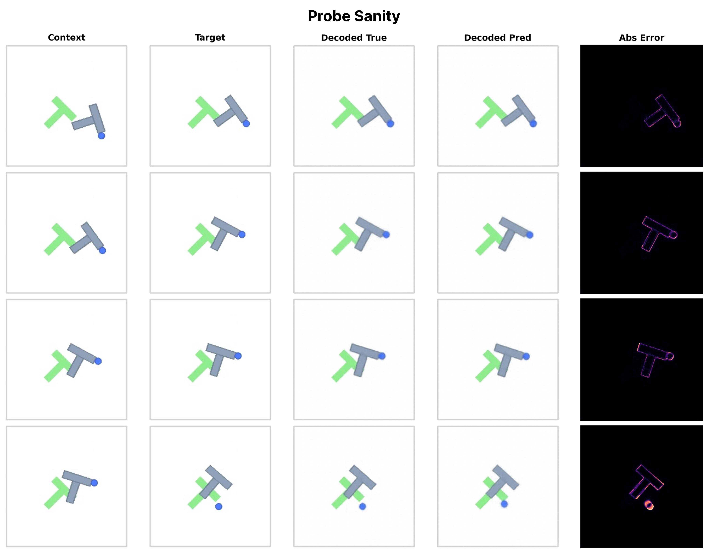

# Hi-LeWM

Code for **Mind the Gap: Promises and Pitfalls of Hierarchical Planning in LeWorldModel**: a research engineering project on hierarchical latent-space planning for long-horizon, goal-conditioned control.


Hi-LeWM extends LeWorldModel with a trainable high-level branch for long-horizon latent planning. Instead of searching directly over primitive actions for the full horizon, it learns latent macro-actions from chunks of low-level behavior, predicts future observation latents with a transformer high-level dynamics model, and uses hierarchical CEM to choose subgoals for the low-level planner.

The codebase includes the training stack, planning policies, diagnostic tools, evaluation configs, tests, and selected figures for the paper. Large datasets and checkpoints are kept out of Git and archived separately on Zenodo at [doi:10.5281/zenodo.21353240](https://doi.org/10.5281/zenodo.21353240).

## Paper and Artifacts

- Paper PDF: [additional_material/mind_the_gap_hi_lewm.pdf](./additional_material/mind_the_gap_hi_lewm.pdf)
- arXiv: [placeholder link](https://arxiv.org/abs/XXXX.XXXXX)
- Workshop: [WM@Booth 2026](https://wm-booth.org/)
- OpenReview: [accepted submission](https://openreview.net/forum?id=2vw6vIV0qC)
- Code and checkpoints: [doi:10.5281/zenodo.21353240](https://doi.org/10.5281/zenodo.21353240)

## Main Contribution

This project investigates a practical question: when does adding temporal hierarchy to a compact latent world model actually help long-horizon planning, and when does it make planning worse?

The core contribution is a complete hierarchical planning implementation on top of LeWorldModel:

- A transformer macro-action encoder maps variable-length primitive action chunks into compact latent actions.
- A high-level transformer predictor learns waypoint-to-waypoint latent dynamics conditioned on those macro-actions.
- A hierarchical CEM planner searches in macro-action space, rolls out the high-level predictor, chooses a latent subgoal, and delegates execution to the low-level LeWM planner.
- A constrained empirical-macro CEM variant restricts high-level search toward macro-actions observed in training trajectories, reducing planner exploitation of unrealistic latent actions.
- A decoder-probe diagnostic stack visualizes whether predicted latent subgoals are meaningful, reachable, and aligned with the low-level controller.

The main empirical result is that naive high-level CEM can underperform flat LeWM: it optimizes macro-actions that look good under the learned predictor but are poorly matched to the low-level controller. Constraining high-level search around empirically observed macro-actions recovers useful hierarchical regimes, especially at longer PushT horizons.

## Technical Architecture

Hi-LeWM keeps the LeWM latent interface and adds a high-level temporal abstraction layer.

### Latent State Interface

Images are encoded into LeWM latent states:

```text
observation o_t -> frozen LeWM encoder f_theta -> latent z_t
goal image o_g -> frozen LeWM encoder f_theta -> latent z_g
```

The low-level planner remains a latent MPC controller: it samples primitive action sequences, rolls them through the low-level predictor, and scores terminal latent distance to a goal or subgoal.

### Macro-Action Encoder

The high-level branch first compresses action chunks between waypoints:

```text
primitive actions a_t:t+k -> Transformer encoder g -> latent macro-action ell_t
```

Implementation details:

- Action tokens are linearly projected to a 192-dimensional model space.
- A learnable `[CLS]` token summarizes the variable-length action chunk.
- The encoder is a 2-layer transformer with 4 attention heads and a 768-dimensional MLP.
- The main macro-action latent dimension is 32, chosen to make high-level CEM search tractable.
- The code also supports VQ macro-action variants with codebook-constrained action latents.

Relevant files: `hi_module.py`, `hi_vq.py`, `hi_train.py`.

### High-Level Predictor

The high-level predictor models abstract latent transitions:

```text
(current latent z_t, macro-action ell_t) -> high-level predictor p_hi -> next waypoint latent z_t+k
```

Implementation details:

- Macro-actions are projected into the LeWM latent space before conditioning.
- The predictor is a transformer-style latent dynamics module with adaptive conditioning.
- Main configuration uses a 192-dimensional latent state, depth 6, 16 attention heads, head dimension 64, MLP dimension 2048, and dropout 0.1.
- Training uses waypoint-level MSE in latent space against encoded future observations.

Relevant files: `hi_jepa.py`, `hi_train.py`, `config/train/hi_lewm.yaml`.

### Hierarchical CEM Planning

At evaluation time, Hi-LeWM plans at two levels:

```text
1. High-level CEM samples macro-action sequences.
2. p_hi rolls them forward in latent space.
3. The best sequence is selected by terminal distance to the goal latent.
4. The first predicted latent waypoint becomes the low-level subgoal.
5. Low-level LeWM CEM plans primitive actions toward that subgoal.
6. The system executes a short prefix and replans.
```

The repo includes standard high-level CEM, staged hierarchical execution, and empirical macro-action CEM. The empirical variant builds a macro-action bank from training trajectories and constrains search around observed behavior, which makes the planner less likely to exploit unsupported regions of the learned high-level action space.

Relevant files: `hi_policy.py`, `hi_eval.py`, `hi_waypoint_sampling.py`.

## ML Engineering Scope

- PyTorch and PyTorch Lightning training loop built around `stable-worldmodel` / LeWorldModel components.
- Hydra configs for train/eval sweeps across PushT, Cube, TwoRoom, and Reacher.
- W&B logging, hyperparameter tracking, resumable run IDs, and structured output directories.
- GPU training with bf16 precision, AdamW, gradient clipping, persistent data-loader workers, prefetching, and pinned memory.
- Multi-seed evaluation protocol with deterministic process setup and explicit planning budgets.
- Decoder-probe reports and plot rendering scripts for inspecting latent subgoal quality.
- Checkpoint conversion and object-checkpoint utilities for working with LeWM-style saved models.
- Tests for planning behavior, waypoint sampling, decoder probes, and training speedups.

## Visual Overview

### Architecture



The training path encodes waypoint observations with the LeWM encoder, encodes the primitive action chunk between waypoints as a macro-action, and trains the high-level predictor to forecast the next waypoint latent.

### PushT Results



PushT is the main long-horizon diagnostic task. The sweep compares flat LeWM, naive Hi-LeWM, and constrained hierarchical planning across increasing goal offsets.

### Subgoal Diagnostics

| Unconstrained CEM | Constrained empirical-macro CEM |
| --- | --- |
|  |  |

These qualitative diagnostics show the gap between visually plausible predicted subgoals and subgoals that the low-level controller can actually reach.

### Decoder Probe



The decoder probe maps latent waypoints back to image space for debugging. It is not part of the acting policy; it is an interpretability tool for inspecting whether high-level latents stay on a meaningful visual manifold.

## Repository Layout

- `additional_material/`: paper PDF, architecture diagram, and selected plots/diagnostic images.
- `hi_train.py`, `hi_eval.py`: hierarchical training and evaluation entrypoints.
- `hi_module.py`, `hi_jepa.py`, `hi_policy.py`, `hi_vq.py`, `hi_waypoint_sampling.py`: core hierarchical model and planning components.
- `hi_decoder_probe.py`, `hi_train_decoder_probe.py`, `hi_decoder_probe_eval.py`: decoder-probe diagnostics.
- `train.py`, `eval.py`: LeWorldModel reproduction wrappers.
- `baseline_adapter.py`, `original_eval_with_manifest.py`: compatibility helpers for loading LeWM checkpoints and reproducing flat-planner results.
- `config/`: Hydra configs for training and evaluation.
- `scripts/`: dataset setup, checkpoint conversion, diagnostics, and figure rendering utilities.
- `tests/`: unit and smoke tests for hierarchical planning and evaluation behavior.
- `third_party/lewm/`: LeWorldModel source used by the reproduction wrappers.

## Installation

Clone recursively so the LeWorldModel dependency is available:

```bash
git clone --recursive https://github.com/NiccoloCase/h-le-wm.git
cd h-le-wm
```

If the repository was cloned without `--recursive`:

```bash
git submodule update --init --recursive
```

Create the CPU/dev environment:

```bash
conda env create -f environment.yml
conda activate lewm
```

For a CUDA environment, use:

```bash
conda env create -f environment-gpu.yml
conda activate lewm-gpu
```

Alternatively, the minimal `uv` setup is:

```bash
uv venv --python=3.10
source .venv/bin/activate
uv pip install "stable-worldmodel[train,env]" pytest
```

## Data

Use the helper script to configure local dataset paths:

```bash
source scripts/setup_datasets.sh --datasets pusht,tworooms,reacher,cube
```

To use a custom data root:

```bash
source scripts/setup_datasets.sh --home /absolute/path/to/stablewm_data --datasets pusht
```

## Hierarchical Training

Default hierarchical training uses the `hi_lewm` Hydra config:

```bash
python hi_train.py
```

Train the compact macro-action model used in the main experiments:

```bash
python hi_train.py \
  data=hi_pusht \
  wm.high_level.latent_action_dim=32 \
  wm.high_level.waypoints.num=5 \
  wm.high_level.waypoints.strategy=random_sorted \
  wm.high_level.waypoints.max_span=15 \
  output_model_name=hi_lewm_pusht_l32
```

Train a fixed-stride ablation:

```bash
python hi_train.py \
  data=hi_pusht \
  wm.high_level.latent_action_dim=32 \
  wm.high_level.waypoints.strategy=fixed_stride \
  wm.high_level.waypoints.num=4 \
  wm.high_level.waypoints.stride=5 \
  output_model_name=hi_lewm_fixed_stride
```

Train a VQ macro-action representation:

```bash
python hi_train.py \
  data=hi_pusht \
  latent_action_encoder.type=vq \
  latent_action_encoder.vq.num_codes=128 \
  output_model_name=hi_lewm_vq128
```

Training uses PyTorch Lightning, Hydra, AdamW, bf16 precision, gradient clipping, object-checkpoint dumping, and optional W&B logging through `WANDB_ENTITY` and `WANDB_PROJECT`.

## Evaluation

Evaluate a hierarchical PushT policy with standard high-level CEM:

```bash
python hi_eval.py --config-name=hi_pusht policy=pusht/hi_lewm
```

Evaluate with empirical macro-action CEM:

```bash
python hi_eval.py \
  --config-name=hi_pusht \
  policy=pusht/hi_lewm \
  planning.high.empirical_macro.enabled=true \
  planning.high.empirical_macro.num_sequences=4096
```

Other task configs follow the same pattern:

```bash
python hi_eval.py --config-name=hi_tworoom policy=tworoom/hi_lewm
python hi_eval.py --config-name=hi_reacher policy=reacher/hi_lewm
python hi_eval.py --config-name=hi_cube policy=cube/hi_lewm
```

For flat LeWorldModel reproduction:

```bash
python train.py data=pusht
python eval.py --config-name=pusht policy=pusht/lewm
```

## Diagnostics

The diagnostic scripts inspect whether high-level predictions are merely close in latent distance or actually useful for control.

- `scripts/run_hi_diagnostic.py`: compares teacher-forced, open-loop, and CEM-selected high-level rollouts.
- `scripts/run_hi_acting_diagnostic.py`: measures whether selected subgoals are reachable by the low-level controller.
- `scripts/run_decoder_probe_report.py`: decodes latent waypoints into image-space panels for inspection.
- `scripts/render_hi_paper_diagnostics.py`, `scripts/render_hi_story_figures.py`: produce qualitative diagnostic figures.

## Checks

```bash
LEWM_WRAPPER_DRY_RUN=1 python train.py data=pusht
LEWM_WRAPPER_DRY_RUN=1 python eval.py --config-name=pusht
LEWM_WRAPPER_DRY_RUN=1 python hi_eval.py --config-name=hi_pusht
python -m pytest
```

The dry-run commands validate CLI wiring without launching expensive training or evaluation jobs.

## Citation

If this repository is useful for your work, please cite the paper and the archived artifact:

```bibtex
@misc{caselli2026mindgap,
  title = {Mind the Gap: Promises and Pitfalls of Hierarchical Planning in LeWorldModel},
  author = {Caselli, Niccolo and Lo Sardo, Salvatore and Massafra, Francesco and Pantelidis, Ippokratis and Punzo, Samuele and Bhethanabhotla, Sathya Kamesh},
  year = {2026}
}
```
